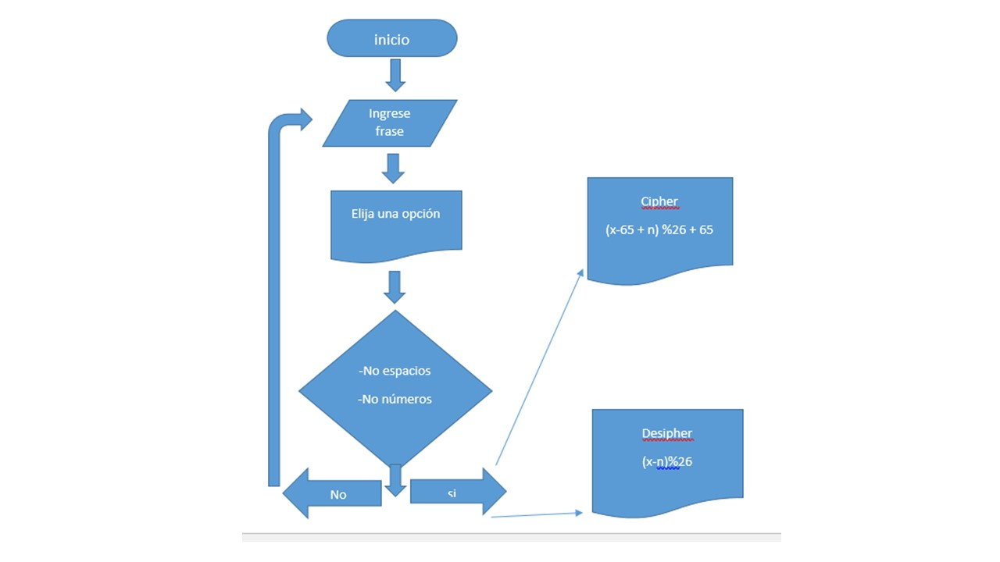

Algoritmo de cifrado César
__________________________

caracteristicas
.La web permitira ingresar un mensaje
.Cifrara y Descifrara ese mismo mensaje
.Devolvera mensaje Cifrado o descifrado
.Indicara si ingreso números o espacios vacíos.

Presentamos el diagrama de flujo:

 
 
Procedemos a explicar el pseudocódigo

// creando funcion cifrar, aplicando cifrado cesar
function cipher( words){
  words = prompt('Por favor ingrese su frase');// el programa debe solicitar una frase
  var str = '';
  for (i= 0; i< words.length;i++){ //se recorre la cadena 
    if(str >= 65 && str <= 90) {///*ver si ´pertenece al rango de las letras que tienen ascii de 65-90*/
      var wordASCII = words[i].charCodeAt(0);
      var numberCipher = ( wordASCII - 65 + 33) % 26 + 65;// se obtiene codigo ascii
      str += String.fromCharCode(numberCipher);// se obtiene la letra de el codigo ascii
    }else {
             wordASCII = words[i].charCodeAt(0);
             numberCipher = ( wordASCII - 97 + 33) % 26 + 97;// se obtiene codigo ascii
      str += String.fromCharCode(numberCipher);// // se obtiene la letra de el codigo ascii
    }else {
    }
    return str;
  }
}

cipher();

